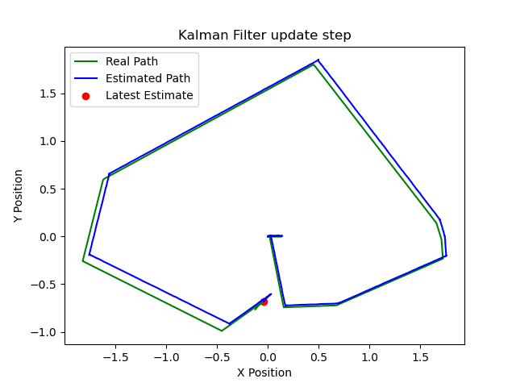
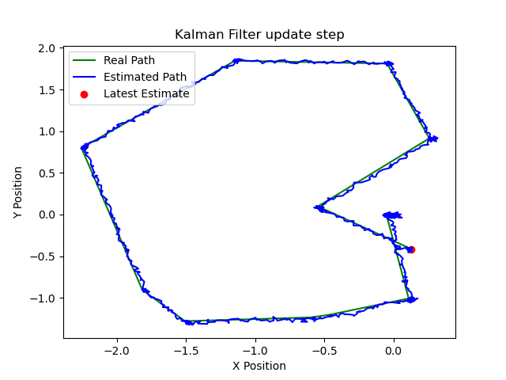
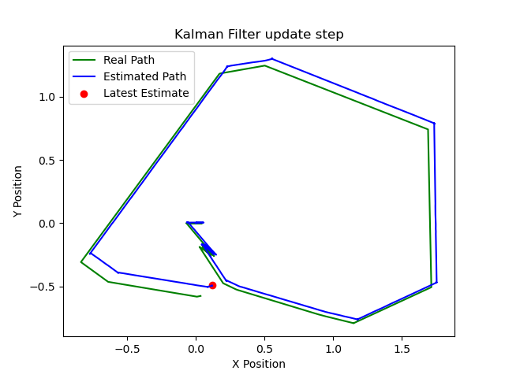
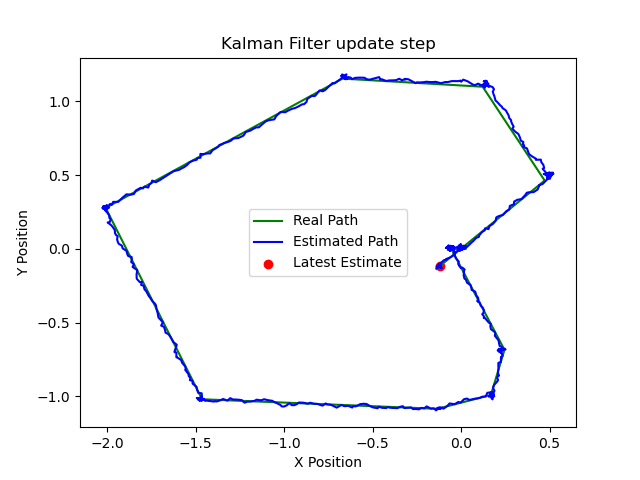
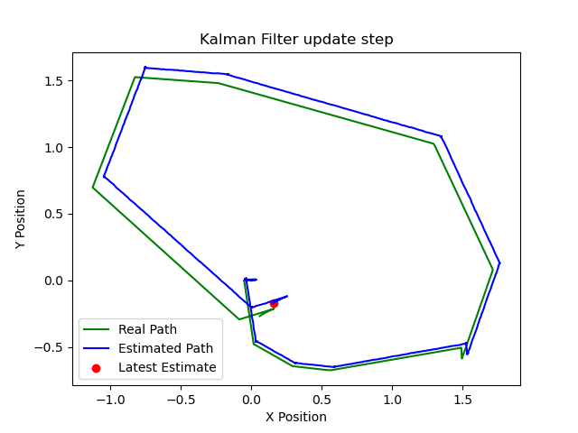
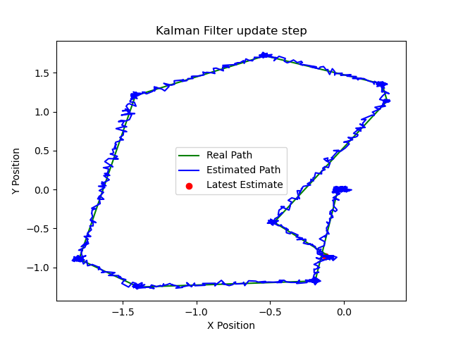

# Práctica 2: Filtro de Kalman en ROS 2
Este repositorio contiene el código implementado para la **Práctica 2: Filtro de Kalman (KF)** de la asignatura de *Ampliación de Robótica*, implementado por el alumno Iván Luque Valverde.

## Estructura del repositorio
 - kalman_filter.py # Implementación del KF con los ruidos altos y bajos definidos para su modificación. 
 - kf_estimation.py # Nodo con el modelo de KF (posición)
 - kf_estimation_vel.py # Nodo con el modelo completo de KF (posición y velocidad) 
 - motion_models.py # Modelos de movimiento A y B 
 - observation_models.py # Modelos de observación C
 - sensor_utils.py # Funciones de alto nivel para facilitar las cosas con los sensores
 - visualization.py # Funciones de visualización de resultados
 - trayectorias # Gráficas obtenidas para las diferentes configuraciones de ruido en los filtros de posición y velocidad.
 
## Diseño del filtro
Los filtros han sido diseñados en base a las estimaciones propuestas por el profesorado.

### Kalman Filter 1 (KF1): 
Se usan los estados de posición y orientación en 2D (x,y,theta), junto a la matriz de transición A y una matriz de control B. El sistema de predicción y estimación se realiza en kf_estimation de la siguiente forma: 
- **Predicción**: en cada mensaje de odometría recibido, el filtro de Kalman primero predice el nuevo estado del robot usando el modelo de movimiento y el último comando de velocidad (self.u). Esto da una estimación previa de la posición y la incertidumbre asociada.
- **Actualización**: luego, se obtiene una observación simulada de la posición real (con posible deriva/ruido) con la función *self.odom_simulator.add_drift*. El filtro compara esta observación con la predicción y ajusta la estimación del estado y la incertidumbre, combinando ambas fuentes de información según su confianza (ruido).
- **Publicación**: finalmente, el nodo publica tanto la estimación del filtro (con su covarianza) como la posición real simulada, para poder comparar y visualizar los resultados.

### Kalman Filter 2 (KF2):
Se usan los estados de posición, orientación y las velocidades lineales y angulares (x,y,theta,vx,vy,omega), junto a la matriz de transición A pues se pide que sea pura, sin control directo. El sistema de predicción y estimación se realiza en kf_estimation_vel de la siguiente forma: 
- **Predicción**: en cada ciclo, el filtro predice la evolución de todas las variables del estado, incluidas las velocidades, usando el modelo de movimiento y el control recibido (velocidad lineal y angular).
- **Actualización**: cuando se recibe una nueva observación (simulada con ruido) mediante *generate_noisy_measurement_2*, se actualizan todas las variables del estado, corrigiendo tanto la posición como las velocidades según la información sensorial y la confianza (ruido) definida.
- **Publicación**: finalmente, el nodo publica tanto la estimación del filtro (con su covarianza) como la posición real simulada, para poder comparar y visualizar los resultados.

El filtro de Kalman 2 proporciona una estimación conjunta y coherente de posición y velocidad, mejorando la precisión y la utilidad de la información para el robot.

## Configuración de ruido bajo
Se han utilizado los valores tomados por defecto como "bajos", siendo estos definidos como low_noise_std_KF1 = [0.02, 0.02, 0.01] y low_noise_std_KF2 = [0.02, 0.02, 0.01, 0.02, 0.02, 0.01].
Los resultados obtenidos para ambos modelos han sido los siguientes: 

Comparando ambos casos se puede observar cómo el filtro de Kalman 1 presenta más oscilaciones y una especie de deriva que se va agrandando con el tiempo, mientras que el otro presenta una trayectoria más real, suave y precisa.

## Configuración de ruido alto solo en la medición (Q)
Se han utilizado los siguientes valores como altos para la medición (self.obs_noise_std): high_noise_std_KF1 = [0.05, 0.05, 0.03] y high_noise_std_KF2 = [0.05, 0.05, 0.03, 0.05, 0.05, 0.03], manteniendo por defecto el otro ruido.
Los resultados obtenidos para ambos modelos han sido los siguientes: 

Al comparar las imágenes con ruido bajo en la medición con estas nuevas imágenes donde el ruido en la medición es alto, se observa:

- Filtro de Kalman 1: La trayectoria estimada se vuelve mucho más irregular y presenta mayores oscilaciones y desviaciones respecto a la trayectoria real. El filtro confía menos en las mediciones (por su alta incertidumbre), por lo que la estimación es menos precisa y más errática.

- Filtro de Kalman 2: la trayectoria estimada sigue siendo más suave y cercana a la real que en el caso del filtro 1. El modelo dinámico y la estimación de velocidades ayudan a compensar la falta de fiabilidad en las mediciones, haciendo que el filtro 2 sea más robusto frente al ruido.

## Configuración de ruido alto solo en el proceso (R)
Se han utilizado los siguientes valores como altos para el proceso (self.proc_noise_std): high_noise_std_KF1 = [0.05, 0.05, 0.03] y high_noise_std_KF2 = [0.05, 0.05, 0.03, 0.05, 0.05, 0.03], manteniendo por defecto el otro ruido.
Los resultados obtenidos para ambos modelos han sido los siguientes:
 

Al comparar las imágenes con ruido bajo en la medición con estas nuevas imágenes donde el ruido en la medición es alto, se observa:

- Filtro de Kalman 1: la trayectoria estimada se vuelve más dispersa y menos precisa. Se observan mayores desviaciones y oscilaciones respecto a la trayectoria real, ya que el filtro confía menos en su propio modelo de movimiento y la estimación se vuelve más inestable.

- Filtro de Kalman 2: la trayectoria estimada sigue siendo más suave y cercana a la real que en el filtro 1. El modelo dinámico y la estimación conjunta de velocidades permiten que el filtro 2 mantenga una mayor robustez y estabilidad, compensando mejor la incertidumbre en el modelo de movimiento.

La mayor diferencia entre estos recae en la confianza que tiene el filtro: con ruido alto en la medición, el filtro es más vulnerable a errores de predicción; con ruido alto en el proceso, es más vulnerable a errores en el modelo de movimiento, pero puede corregirse mejor si las mediciones son fiables.

## Ejecución de los nodos
La ejecución del código mantiene lo propuesto anteriormente, siendo necesario realizar los siguientes pasos:
- git clone https://github.com/IvanLuqueValverde/p2_kl_ilv.git
- cd p2_kf_ilv
- colcon build --packages-select p2_kf_ilv
- source install/setup.bash

A continuación hace falta tener un terminal abierto con el robot:
- ros2 launch turtlebot4_ignition_bringup turtlebot4_ignition.launch.py slam:=true nav2:=true rviz:=true

Finalmente, seleccionar cual de los dos filtros se va a utilizar en una nueva ventana. Adicionalmente, para modificar el ruido usado, es necesario entrar en el archivo /filters/kalman_filter.py y cambiar los valores seleccionados como low por high. La ejecución de los mismos se realiza mediante la ejecución de el siguiente código en función de si se precede usar velocidad o posición:
- ros2 run p2_kf_ilv kf_estimation
- ros2 run p2_kf_ilv kf_estimation_vel
